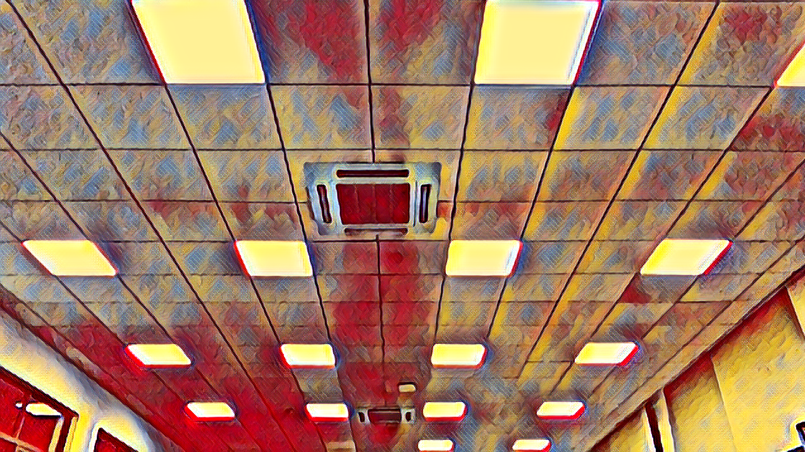

# pytorch-style-transfer-fast

### usage

1. train
* run `python3 train.py` to train the model and generate the model parameters for TransformerNet.
* the generated binary file will be save at `binaries/`

2. test with camera
* run `python3 test_with_camera.py` to test the style transfer algorithm. The stylized image will be presented every 5 seconds.

### Example

  
